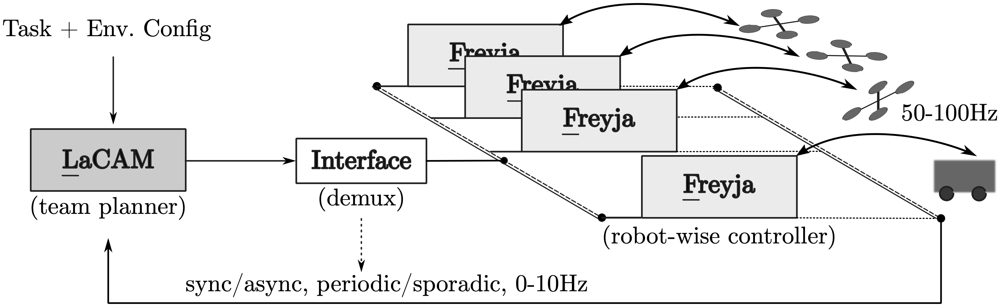
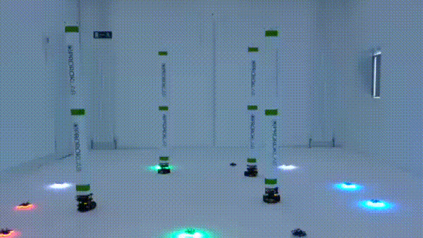
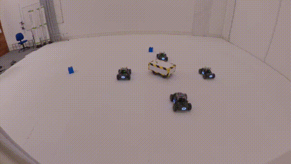
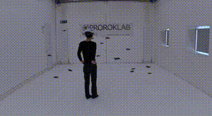

#  LF       Online Multi-Robot Path Planning Meets Optimal Trajectory Control   
---

LF is a multi-robot control paradigm to solve point-to-point navigation tasks for a _team_ of holonomic robots with access to the full environment information. It designs a heirarchical structure to multi-robot planning and control: it invokes two processes asynchronously at high frequency:
- [LaCAM](https://github.com/kei18/lacam3), a <ins>centralized</ins>, discrete, and full-horizon planner for computing collision- and deadlock-free paths rapidly, leveraging recent advances in multi-agent pathfinding (MAPF), and
- [Freyja](https://github.com/ajshank/Freyja), dynamics-aware, robot-wise <ins>decentralised</ins> trajectory controllers that ensure all robots independently follow their assigned paths reliably.

  

LF[^1] adds some additional glue to combine the speed of ultra-fast discrete _joint-space_ planners, and the robustness of _on-robot_ trajectory controllers. The planner is no longer a one-shot top-level call, it can be triggered in an MPC-like fashion, where it plans the rest of the trajectory (team trajectories) towards the goals, and the controller executes the first _n_ steps of it. We are "embedding" the planner into a feedback control loop!

<table>
  <tr>
    <td> </td>
    <td>
      
       
      
    </td>
  </tr>
</table>

At the moment, LF can trigger its planner at upto 20Hz on a laptop CPU &mdash; this can be   
✔️ **synchronous** (for all agents simultaneously),   
✔️ **asynchronous** (for some agents, "lifelong"),   
✔️ **periodic** (fixed-rate, MPC-like), or   
✔️ **sporadic** (event-triggered, based on goal assignment, current tracking performance, or detection of new obstacles).

> [!NOTE]
> Our implementation does not implicitly define "events" for triggering LF's planner. The API is exposed for such use-cases.

### Code
(in review)

[^1]: Hmm, is "LF" a play on `LF (line feed)` -- the metaphorical end of the line in MAPF+control? Maybe.
